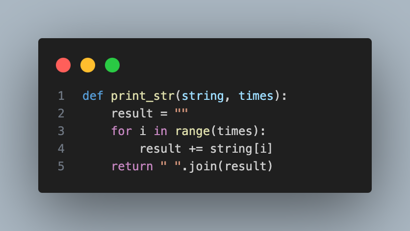
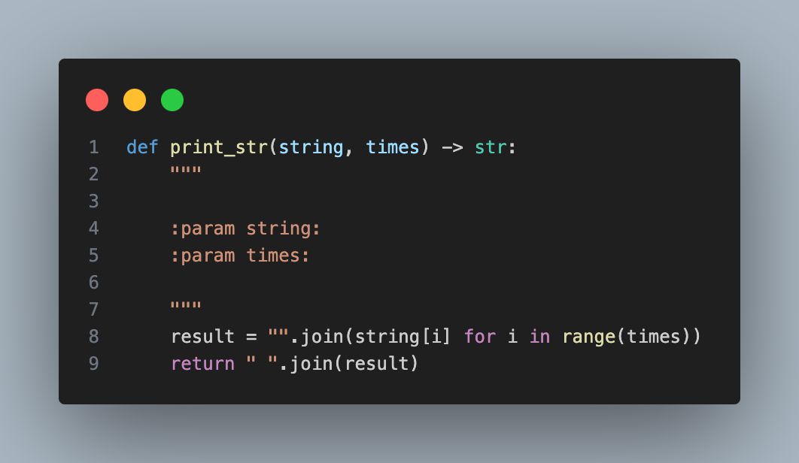

# AssessMate

AssessMate is shell script automation tool designed to streamline the analysis, optimization, and maintenance of Python codebases.

It performs a series of tasks including code style checks, code formatting, security analysis, and cleanup of cache and temporary files. Users are guided through the process of selecting individual files or entire directories for analysis, with options to run various tools such as Pytype, Pylint, Sourcery, Bandit, and Pyright.

Additionally, the script offers functionality to clean cache and temporary files to maintain codebase hygiene. Overall, it provides a convenient and efficient way to ensure code quality and security in Python projects

> ***Prerequisite***: Python must be installed on your system in order to run the script.

---

## Table of Contents

- [AssessMate](#assessmate)
  - [Table of Contents](#table-of-contents)
  - [Installation](#installation)
  - [Usage](#usage)
  - [Configuration](#configuration)
  - [Contributing](#contributing)
  - [License](#license)

---

## Installation

1. Clone the repository:

    ```bash
    git clone https://github.com/ktreharrison/assessmate.git
    ```

2. Navigate to the directory:

    ```bash
    cd your_repository
    ```

3. Run the setup script:

    ```bash
    ./setup.sh
    ```

---

## Usage

To use the script, follow these steps:

```bash
./main.sh
```

Follow the on-screen prompts to analyze your Python code.

| Before | After |
|--------|--------|
|  | |

---

## Configuration

You can customize certain aspects of the script behavior by modifying variables within the script itself. Refer to the comments in the script for guidance.

---

## Contributing

If you'd like to contribute to this project, please follow these steps:

1. Fork the repository.
2. Create a new branch (`git checkout -b feature/my-feature`).
3. Make your changes.
4. Commit your changes (`git commit -am 'Add new feature'`).
5. Push to the branch (`git push origin feature/my-feature`).
6. Create a new Pull Request.

## License

This project is licensed under the [MIT License](LICENSE).
